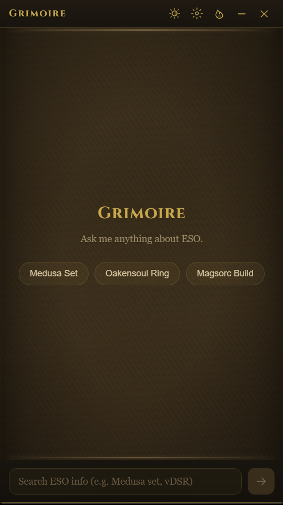
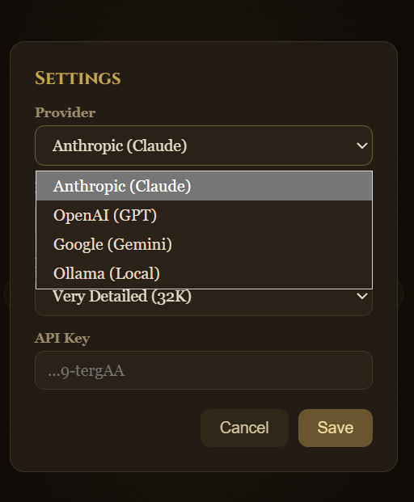
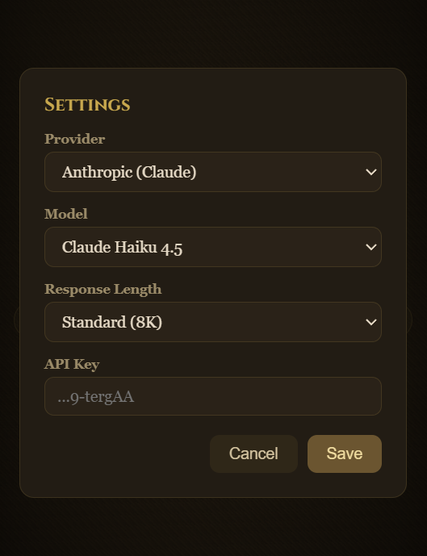
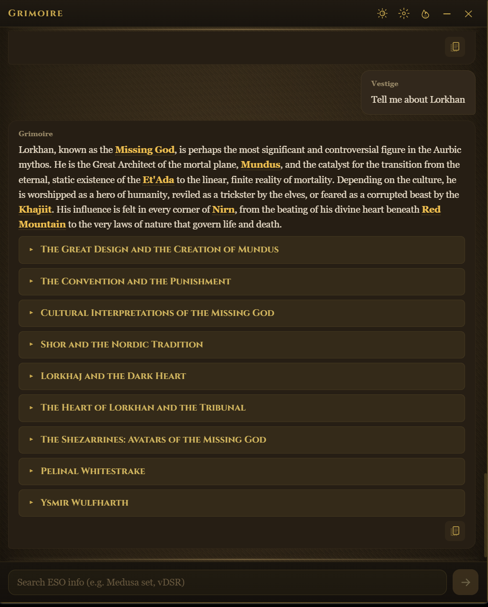
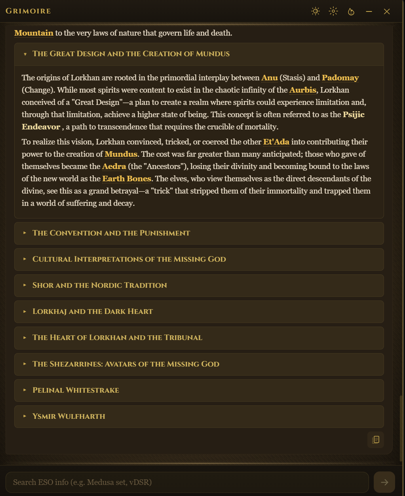
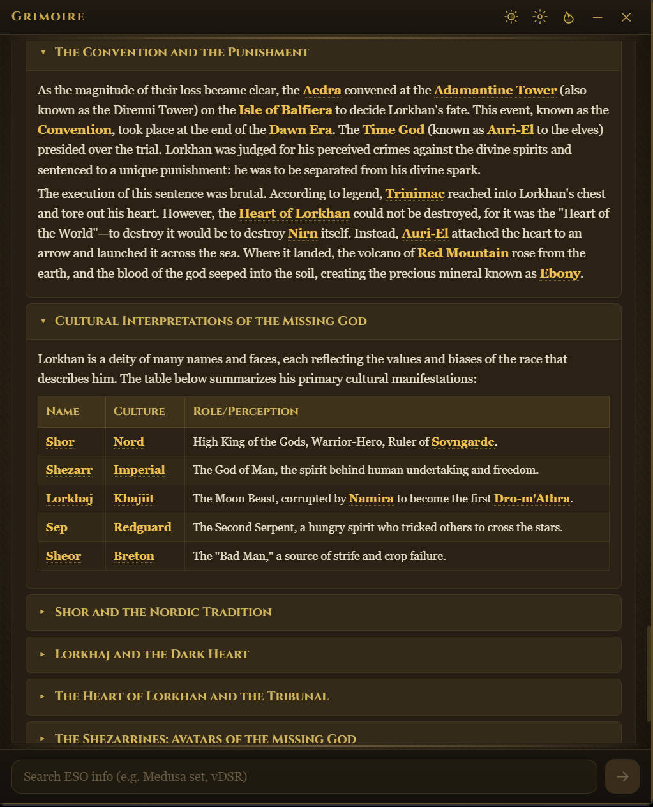
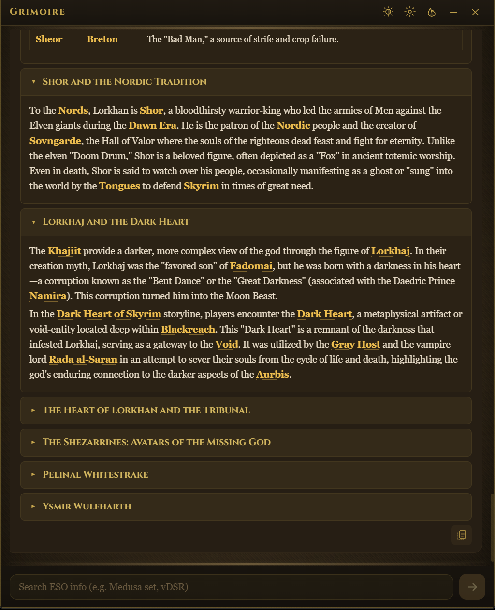
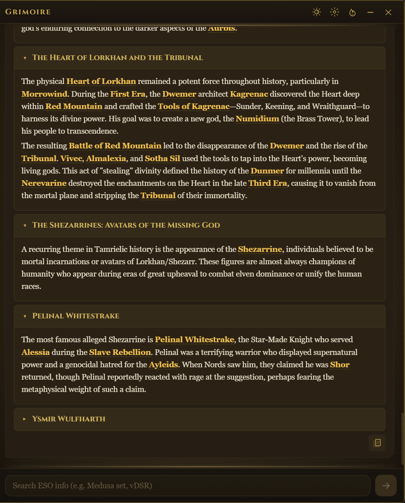
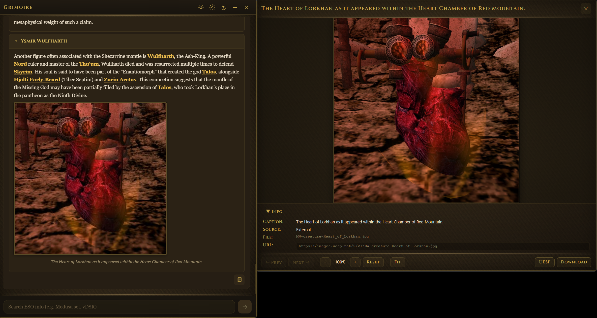

# Grimoire

An AI-powered Elder Scrolls Online companion that runs as an in-game overlay. Ask anything about ESO — from set bonuses and quest guides to deep lore about the Daedric Princes.


## Features

### Always-On Overlay
Grimoire lives on top of your game as a compact, draggable mini bar. Click to expand the full chat panel — no alt-tabbing required.



### Multi-Provider AI
Choose your preferred LLM provider. Bring your own API key and switch freely between models.

<p align="center">
  
  &nbsp;&nbsp;
  
</p>

**Supported Providers:**
| Provider | Models |
|----------|--------|
| Anthropic | Claude Haiku 4.5, Sonnet 4, Opus 4 |
| Google | Gemini 2.5 Flash, Pro |
| OpenAI | GPT-4o, GPT-4o Mini |
| Ollama | Any local model (Qwen, Gemma, Llama, etc.) |

### Deep Lore Knowledge

Ask complex lore questions and get comprehensive, structured answers with collapsible sections, inline UESP references, and comparison tables — all sourced from a local database of **30,000+ UESP wiki pages**.

> *"Tell me about Lorkhan"*







### Integrated Image Viewer

In-line images open in a dedicated side-car viewer with zoom, pan, and source details.



### Quick Lookup

Select any highlighted term (item, place, NPC) to instantly ask Grimoire or jump to the UESP wiki page.


---

## How It Works

Grimoire combines a **structured SQLite database** with **semantic vector search** to give the AI accurate, grounded answers instead of hallucinations.

### Data Pipeline

```
UESP Wiki (30,506 pages)
    │
    ├─ Structured Parsing ──→ SQLite DB
    │   Sets, Quests, Skills, Dungeons,
    │   NPCs, Zones, Boss Strategies,
    │   Alchemy Combos, Quest Chains
    │
    └─ Lore Namespace ──→ Vector Search
        6,731 pages → 8,997 chunks
        Voyage AI embeddings (512d)
        Hybrid: Vector + BM25 + Reranker
```

### Query Routing

| Query Type | Mode | How It Works |
|-----------|------|-------------|
| *"Mother's Sorrow set"* | **Strict** | Direct DB lookup → deterministic answer |
| *"Best magicka build?"* | **Creative** | LLM autonomously searches DB + wiki |
| *"Why did the Dwemer disappear?"* | **Lore** | Hybrid vector search → sourced narrative |

### Database Stats

| Category | Count |
|----------|-------|
| Total Crawled Pages | 30,506 |
| Structured Records | 10,552 |
| Equipment Sets | 720 |
| Quests (with chains) | 2,383 |
| Skills | 650 |
| Dungeon Bosses | 347 |
| Lore Text Chunks | 8,997 |
| Embedded Vectors | 8,997 |
| Entity Relationships | 2,743 |

---

## Tech Stack

| Layer | Technology |
|-------|-----------|
| Desktop App | [Tauri](https://tauri.app) + Svelte |
| Backend | Python, FastAPI |
| Structured DB | SQLite with FTS5 |
| Vector DB | LanceDB (file-based, no server) |
| Embeddings | Voyage AI (voyage-4) |
| Reranker | Voyage AI (rerank-2.5) |
| Data Source | [UESP Wiki](https://en.uesp.net) MediaWiki API |

## Getting Started

### Prerequisites
- Python 3.10+
- Node.js 18+
- Rust (for Tauri)
- An API key from at least one LLM provider

### Installation

```bash
# Clone the repository
git clone https://github.com/yourusername/grimoire.git
cd grimoire

# Install Python dependencies
pip install -r requirements.txt

# Install frontend dependencies
npm install

# Build the ESO database (first time only)
python -m pipeline.crawler        # Crawl UESP wiki pages
python -m pipeline.indexer        # Parse into structured data
python -m pipeline.linker         # Build entity relationships
python -m pipeline.build_lore     # Crawl + chunk + embed lore

# Run in development mode
npm run dev
```

### Configuration

On first launch, open **Settings** (gear icon) to select your AI provider and enter your API key.

## License

MIT
